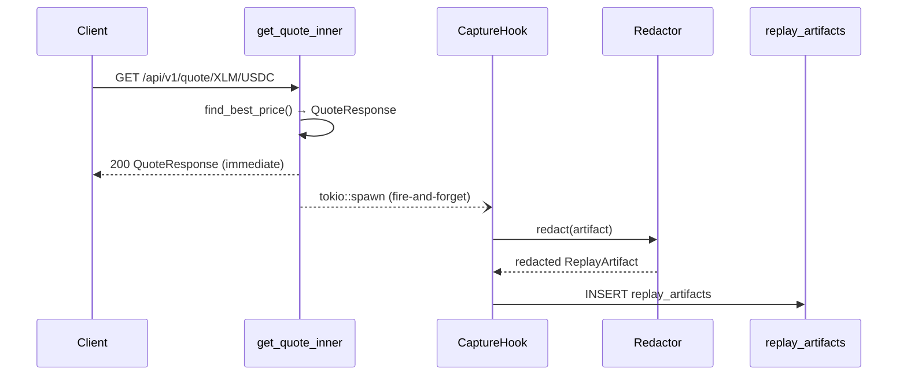
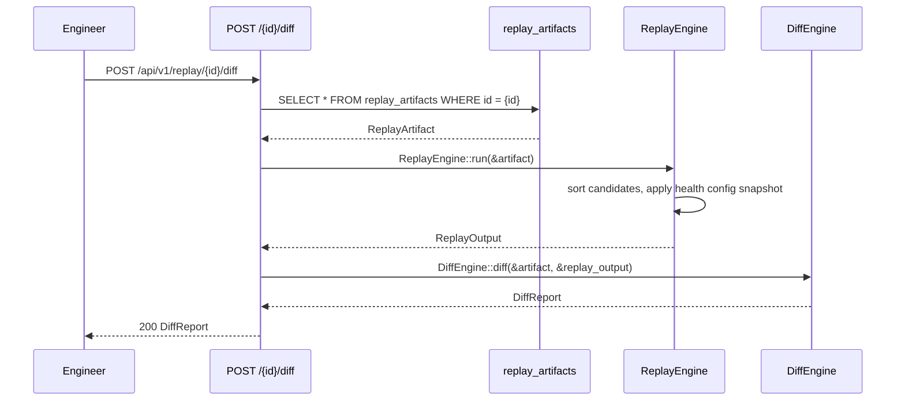

# Design: Quote Replay System

## Overview

The Quote Replay System is a purely additive pipeline layered on top of the existing StellarRoute quote engine. It captures a deterministic snapshot of every quote computation — inputs, liquidity candidates, health config, and output — and stores it as a `ReplayArtifact`. Engineers can later retrieve an artifact, re-run the route selection logic against the embedded snapshot (no live DB reads), and diff the result against the original output.

The system is designed for post-incident analysis and regression prevention. It never touches existing handlers, models, or routing logic.

Key design principles:
- **Purely additive**: zero changes to `quote.rs`, `state.rs`, existing models, or the router beyond adding new routes.
- **Determinism by construction**: the replay engine re-uses the same sort comparator (`price ASC, venue_type ASC, venue_ref ASC`) and the same `HealthScoringConfig` snapshot stored in the artifact.
- **Non-blocking capture**: artifact persistence is a fire-and-forget `tokio::spawn` task; the quote response is returned before the DB write completes.
- **Privacy by default**: `asset_issuer` values are replaced with `[REDACTED]` before any artifact reaches the DB.

---

## Architecture

```mermaid
graph TD
    subgraph Existing Pipeline
        A[GET /api/v1/quote] --> B[get_quote_inner]
        B --> C[find_best_price]
        C --> D[evaluate_single_hop_direct_venues]
        D --> E[QuoteResponse]
    end

    subgraph Capture Hook (additive)
        E -->|fire-and-forget tokio::spawn| F[CaptureHook]
        F --> G[Redactor]
        G --> H[ReplayArtifact]
        H --> I[(replay_artifacts table)]
    end

    subgraph Replay API (new routes)
        J[POST /capture] --> F
        K[GET /{id}] --> I
        L[POST /{id}/run] --> M[ReplayEngine]
        N[POST /{id}/diff] --> M
        M --> I
        M --> O[DiffEngine]
    end

    subgraph CLI
        P[replay-cli] --> M
        P --> I
    end
```

### Module Layout

```
crates/api/src/
├── replay/
│   ├── mod.rs              # pub re-exports
│   ├── artifact.rs         # ReplayArtifact struct + DB CRUD
│   ├── engine.rs           # ReplayEngine: runs route selection on snapshot
│   ├── diff.rs             # DiffEngine: field-level comparison → DiffReport
│   └── redactor.rs         # Redactor: replaces asset_issuer with [REDACTED]
├── routes/
│   └── replay.rs           # Axum handlers for /api/v1/replay/...
└── bin/
    └── replay-cli.rs       # CLI entry point

crates/api/migrations/
└── 0002_replay_artifacts.sql
```

---

## Components and Interfaces

### `replay/artifact.rs`

Owns the `ReplayArtifact` struct and all DB operations (insert, fetch by ID, prune).

```rust
pub struct ReplayArtifact {
    pub id: Uuid,
    pub schema_version: u32,          // current: 1
    pub incident_id: Option<String>,  // optional label for incident correlation
    pub captured_at: DateTime<Utc>,

    // Request inputs
    pub base: String,
    pub quote: String,
    pub amount: String,
    pub slippage_bps: u32,
    pub quote_type: String,

    // Snapshot of normalized_liquidity candidates at capture time
    pub liquidity_snapshot: Vec<LiquidityCandidate>,

    // HealthScoringConfig snapshot
    pub health_config_snapshot: HealthConfigSnapshot,

    // The QuoteResponse produced by the live pipeline (redacted)
    pub original_output: serde_json::Value,
}

pub struct LiquidityCandidate {
    pub venue_type: String,
    pub venue_ref: String,
    pub price: String,
    pub available_amount: String,
}

pub struct HealthConfigSnapshot {
    pub freshness_threshold_secs_sdex: u64,
    pub freshness_threshold_secs_amm: u64,
    pub staleness_threshold_secs: u64,
    pub min_tvl_threshold_e7: i128,
}
```

DB operations (all `async`, return `Result<_, ApiError>`):

```rust
impl ReplayArtifact {
    pub async fn insert(db: &PgPool, artifact: &ReplayArtifact) -> Result<Uuid>;
    pub async fn fetch(db: &PgPool, id: Uuid) -> Result<ReplayArtifact>;
    pub async fn prune_older_than(db: &PgPool, retention: Duration) -> Result<u64>;
}
```

### `replay/engine.rs`

Accepts a `ReplayArtifact` and re-runs the deterministic route selection using only the embedded snapshot. No DB access.

```rust
pub struct ReplayEngine;

pub struct ReplayOutput {
    pub artifact_id: Uuid,
    pub selected_source: String,
    pub price: String,
    pub path: Vec<PathStep>,
    pub is_deterministic: bool,  // true when selected_source matches original_output
    pub replayed_at: DateTime<Utc>,
}

impl ReplayEngine {
    pub fn run(artifact: &ReplayArtifact) -> Result<ReplayOutput>;
}
```

The engine validates `schema_version == CURRENT_SCHEMA_VERSION` before proceeding, returning `ApiError::BadRequest` on mismatch.

### `replay/diff.rs`

Compares two `ReplayOutput` values (or a `ReplayOutput` against the stored `original_output`) and produces a field-level `DiffReport`.

```rust
pub struct DiffReport {
    pub artifact_id: Uuid,
    pub is_identical: bool,
    pub divergences: Vec<FieldDivergence>,
}

pub struct FieldDivergence {
    pub field: String,
    pub original: serde_json::Value,
    pub replayed: serde_json::Value,
}

pub struct DiffEngine;

impl DiffEngine {
    /// Compare replay output against the original stored in the artifact.
    pub fn diff(artifact: &ReplayArtifact, replay: &ReplayOutput) -> DiffReport;
}
```

Numeric string fields (`price`, `total`, `amount`) are parsed as `f64` and compared with a tolerance of `1e-7`.

### `replay/redactor.rs`

Replaces all `asset_issuer` values with `[REDACTED]` before storage.

```rust
pub struct Redactor;

impl Redactor {
    /// Redact all asset_issuer fields in a ReplayArtifact in-place.
    pub fn redact(artifact: &mut ReplayArtifact);

    /// Redact asset_issuer fields in an arbitrary serde_json::Value tree.
    pub fn redact_value(value: &mut serde_json::Value);
}
```

The redactor walks the JSON tree recursively. Any object key named `"asset_issuer"` with a non-null string value is replaced with `"[REDACTED]"`. Native assets (where `asset_issuer` is absent or null) are left unchanged.

### `routes/replay.rs`

Four Axum handlers wired into `create_router`. All return `Result<Json<T>>` using the existing `ApiError` type.

```rust
// POST /api/v1/replay/capture
pub async fn capture_quote(
    State(state): State<Arc<AppState>>,
    Json(req): Json<CaptureRequest>,
) -> Result<Json<CaptureResponse>>;

// GET /api/v1/replay/:artifact_id
pub async fn get_artifact(
    State(state): State<Arc<AppState>>,
    Path(artifact_id): Path<Uuid>,
) -> Result<Json<ReplayArtifact>>;

// POST /api/v1/replay/:artifact_id/run
pub async fn run_replay(
    State(state): State<Arc<AppState>>,
    Path(artifact_id): Path<Uuid>,
) -> Result<Json<ReplayOutput>>;

// POST /api/v1/replay/:artifact_id/diff
pub async fn diff_replay(
    State(state): State<Arc<AppState>>,
    Path(artifact_id): Path<Uuid>,
) -> Result<Json<DiffReport>>;
```

Request/response types:

```rust
pub struct CaptureRequest {
    pub base: String,
    pub quote: String,
    pub amount: Option<String>,
    pub slippage_bps: Option<u32>,
    pub quote_type: Option<String>,
    pub incident_id: Option<String>,
}

pub struct CaptureResponse {
    pub artifact_id: Uuid,
    pub captured_at: DateTime<Utc>,
}
```

### `bin/replay-cli.rs`

A standalone binary using `clap` for argument parsing. Connects to the DB via `DATABASE_URL` env var.

```
replay run <artifact_id>     # fetch + replay → print ReplayOutput as JSON
replay diff <artifact_id>    # fetch + replay + diff → print DiffReport as JSON
replay export <artifact_id>  # fetch → write to <artifact_id>.json
replay import <file>         # read JSON → insert as new artifact
```

Exit codes: `0` on success, `1` on any error (artifact not found, DB error, schema mismatch). Errors go to stderr.

### Capture Hook Integration

The capture hook is invoked inside `get_quote_inner` after the `QuoteResponse` is assembled, before it is returned. It is gated by a `replay_capture_enabled: bool` field added to `AppState` (or `ServerConfig`).

```rust
// Inside get_quote_inner, after response is built — purely additive
if state.replay_capture_enabled {
    let artifact = build_artifact(&base_asset, &quote_asset, &params, &candidates, &health_config, &response);
    let db = state.db.clone();
    tokio::spawn(async move {
        if let Err(e) = ReplayArtifact::insert(&db, &artifact).await {
            tracing::warn!(error = %e, "replay capture failed (non-fatal)");
        }
    });
}
```

---

## Data Models

### Database Migration

```sql
-- crates/api/migrations/0002_replay_artifacts.sql

CREATE TABLE IF NOT EXISTS replay_artifacts (
    id              UUID PRIMARY KEY DEFAULT gen_random_uuid(),
    schema_version  INTEGER NOT NULL DEFAULT 1,
    incident_id     TEXT,
    captured_at     TIMESTAMPTZ NOT NULL DEFAULT NOW(),

    -- Request inputs
    base            TEXT NOT NULL,
    quote           TEXT NOT NULL,
    amount          TEXT NOT NULL,
    slippage_bps    INTEGER NOT NULL,
    quote_type      TEXT NOT NULL,

    -- Snapshots stored as JSONB
    liquidity_snapshot      JSONB NOT NULL,
    health_config_snapshot  JSONB NOT NULL,
    original_output         JSONB NOT NULL
);

CREATE INDEX IF NOT EXISTS idx_replay_artifacts_captured_at
    ON replay_artifacts(captured_at DESC);

CREATE INDEX IF NOT EXISTS idx_replay_artifacts_incident_id
    ON replay_artifacts(incident_id)
    WHERE incident_id IS NOT NULL;

COMMENT ON TABLE replay_artifacts IS
    'Deterministic replay snapshots for post-incident quote analysis';
COMMENT ON COLUMN replay_artifacts.schema_version IS
    'Artifact schema version; replayer validates compatibility before running';
COMMENT ON COLUMN replay_artifacts.liquidity_snapshot IS
    'Snapshot of normalized_liquidity candidates at capture time (redacted)';
COMMENT ON COLUMN replay_artifacts.health_config_snapshot IS
    'HealthScoringConfig values used during the original quote computation';
COMMENT ON COLUMN replay_artifacts.original_output IS
    'Serialized QuoteResponse from the live pipeline (asset_issuer redacted)';
```

### Rust Structs (full field types)

```rust
// replay/artifact.rs
#[derive(Debug, Clone, Serialize, Deserialize)]
pub struct ReplayArtifact {
    pub id: Uuid,
    pub schema_version: u32,
    pub incident_id: Option<String>,
    pub captured_at: DateTime<Utc>,
    pub base: String,
    pub quote: String,
    pub amount: String,
    pub slippage_bps: u32,
    pub quote_type: String,
    pub liquidity_snapshot: Vec<LiquidityCandidate>,
    pub health_config_snapshot: HealthConfigSnapshot,
    pub original_output: serde_json::Value,
}

#[derive(Debug, Clone, Serialize, Deserialize)]
pub struct LiquidityCandidate {
    pub venue_type: String,   // "sdex" | "amm"
    pub venue_ref: String,
    pub price: String,        // decimal string, 7 decimal places
    pub available_amount: String,
}

#[derive(Debug, Clone, Serialize, Deserialize)]
pub struct HealthConfigSnapshot {
    pub freshness_threshold_secs_sdex: u64,
    pub freshness_threshold_secs_amm: u64,
    pub staleness_threshold_secs: u64,
    pub min_tvl_threshold_e7: i128,
}

// replay/engine.rs
#[derive(Debug, Clone, Serialize, Deserialize)]
pub struct ReplayOutput {
    pub artifact_id: Uuid,
    pub selected_source: String,
    pub price: String,
    pub path: Vec<PathStep>,
    pub is_deterministic: bool,
    pub replayed_at: DateTime<Utc>,
}

// replay/diff.rs
#[derive(Debug, Clone, Serialize, Deserialize)]
pub struct DiffReport {
    pub artifact_id: Uuid,
    pub is_identical: bool,
    pub divergences: Vec<FieldDivergence>,
}

#[derive(Debug, Clone, Serialize, Deserialize)]
pub struct FieldDivergence {
    pub field: String,
    pub original: serde_json::Value,
    pub replayed: serde_json::Value,
}
```

---

## Sequence Diagrams

### Capture Flow (automatic, fire-and-forget)



### Replay + Diff Flow



---

## Correctness Properties

*A property is a characteristic or behavior that should hold true across all valid executions of a system — essentially, a formal statement about what the system should do. Properties serve as the bridge between human-readable specifications and machine-verifiable correctness guarantees.*

### Property 1: Artifact structural invariants

*For any* set of valid quote inputs and a corresponding `QuoteResponse`, the artifact produced by the capture hook must have a non-empty `schema_version` (equal to the current version constant), a `captured_at` timestamp that is not in the future, and a non-empty `base`, `quote`, and `amount` field.

**Validates: Requirements 1.1, 1.2**

### Property 2: Replay determinism

*For any* stored `ReplayArtifact`, running `ReplayEngine::run` twice on the same artifact must produce identical `selected_source` and `price` values, and `is_deterministic` must be `true` when the selected source matches the `selected_source` recorded in `original_output`.

**Validates: Requirements 2.1, 2.2, 2.4**

### Property 3: Redactor eliminates all issuer values

*For any* `ReplayArtifact` containing arbitrary `asset_issuer` strings, after `Redactor::redact` is applied, the serialized JSON of the artifact must not contain any of the original issuer strings anywhere in the document. Native assets (null or absent `asset_issuer`) must remain unchanged.

**Validates: Requirements 4.1, 4.2, 4.4**

### Property 4: Diff of identical outputs is empty

*For any* `ReplayArtifact` where the replay produces the same `selected_source` and `price` as `original_output`, `DiffEngine::diff` must return a `DiffReport` with `is_identical = true` and an empty `divergences` list.

**Validates: Requirements 3.1, 3.3**

### Property 5: Diff of differing outputs lists all divergent fields

*For any* pair of `ReplayOutput` values that differ in at least one field, `DiffEngine::diff` must return a `DiffReport` where `divergences` contains exactly one entry per differing field, each entry carrying the correct `original` and `replayed` values.

**Validates: Requirements 3.1, 3.2**

### Property 6: Numeric diff tolerance

*For any* two numeric string values that differ by less than `1e-7` when parsed as `f64`, `DiffEngine` must treat them as equal and must not include them in `divergences`.

**Validates: Requirements 3.4**

### Property 7: Artifact store-and-retrieve round trip

*For any* `ReplayArtifact`, inserting it into the DB via `ReplayArtifact::insert` and then fetching it via `ReplayArtifact::fetch` with the returned ID must produce a value equal to the original artifact (all fields preserved through JSON serialization round-trip).

**Validates: Requirements 5.2**

### Property 8: Pruning deletes exactly the eligible artifacts

*For any* set of artifacts with varying `captured_at` timestamps and a given retention `Duration`, `ReplayArtifact::prune_older_than` must delete exactly those artifacts whose `captured_at` is strictly older than `now - retention`, leaving all others intact.

**Validates: Requirements 7.1, 7.2**

---

## Error Handling

| Scenario | Error type | HTTP status |
|---|---|---|
| Artifact ID not found | `ApiError::NotFound` | 404 |
| Schema version mismatch | `ApiError::BadRequest` | 400 |
| Invalid UUID in path | `ApiError::Validation` | 400 |
| DB insert/fetch failure | `ApiError::Database` | 500 |
| Capture hook DB failure | logged as `WARN`, swallowed | — (non-fatal) |
| Empty liquidity snapshot in artifact | `ApiError::BadRequest` | 400 |
| CLI: artifact not found | stderr + exit 1 | — |
| CLI: schema mismatch | stderr + exit 1 | — |

Capture failures are always non-fatal. The quote response has already been returned to the client before the spawn task runs; any error is logged at `WARN` level with the artifact ID and error message, then discarded.

---

## Testing Strategy

### Dual Testing Approach

Both unit tests and property-based tests are required. Unit tests cover specific examples, integration points, and error conditions. Property tests verify universal correctness across randomly generated inputs.

### Unit Tests

- `ReplayEngine::run` with a hand-crafted artifact returns the expected `selected_source`.
- `ReplayEngine::run` with `schema_version = 99` returns `ApiError::BadRequest`.
- `DiffEngine::diff` with two identical outputs returns `is_identical = true`.
- `DiffEngine::diff` with differing `price` fields returns one `FieldDivergence`.
- `Redactor::redact` on a native-only artifact leaves all fields unchanged.
- `POST /api/v1/replay/capture` with valid params returns 200 and an artifact ID.
- `GET /api/v1/replay/{unknown_id}` returns 404.
- Feature flag disabled: no artifact is inserted after a quote.

### Property-Based Tests

Using `proptest` (already in `[dev-dependencies]`). Each test runs a minimum of 100 iterations.

**Property 1 — Artifact structural invariants**
```
// Feature: quote-replay-system, Property 1: artifact structural invariants
proptest! {
    fn artifact_has_required_fields(inputs in arb_capture_inputs()) {
        let artifact = build_artifact_from(inputs);
        prop_assert_eq!(artifact.schema_version, CURRENT_SCHEMA_VERSION);
        prop_assert!(!artifact.base.is_empty());
        prop_assert!(!artifact.quote.is_empty());
        prop_assert!(!artifact.amount.is_empty());
    }
}
```

**Property 2 — Replay determinism**
```
// Feature: quote-replay-system, Property 2: replay determinism
proptest! {
    fn replay_is_deterministic(artifact in arb_replay_artifact()) {
        let out1 = ReplayEngine::run(&artifact).unwrap();
        let out2 = ReplayEngine::run(&artifact).unwrap();
        prop_assert_eq!(out1.selected_source, out2.selected_source);
        prop_assert_eq!(out1.price, out2.price);
    }
}
```

**Property 3 — Redactor eliminates all issuer values**
```
// Feature: quote-replay-system, Property 3: redactor eliminates all issuer values
proptest! {
    fn redactor_removes_all_issuers(artifact in arb_artifact_with_issuers()) {
        let original_issuers = collect_issuers(&artifact);
        let mut redacted = artifact.clone();
        Redactor::redact(&mut redacted);
        let json = serde_json::to_string(&redacted).unwrap();
        for issuer in &original_issuers {
            prop_assert!(!json.contains(issuer.as_str()));
        }
    }
}
```

**Property 4 — Diff of identical outputs is empty**
```
// Feature: quote-replay-system, Property 4: diff of identical outputs is empty
proptest! {
    fn diff_identical_is_empty(artifact in arb_replay_artifact()) {
        let replay = ReplayEngine::run(&artifact).unwrap();
        // Construct a matching artifact where original_output mirrors replay
        let report = DiffEngine::diff(&artifact_matching_replay(&artifact, &replay), &replay);
        prop_assert!(report.is_identical);
        prop_assert!(report.divergences.is_empty());
    }
}
```

**Property 5 — Diff of differing outputs lists all divergent fields**
```
// Feature: quote-replay-system, Property 5: diff lists all divergent fields
proptest! {
    fn diff_captures_all_divergences(
        artifact in arb_replay_artifact(),
        new_price in "[0-9]{1,5}\\.[0-9]{7}",
    ) {
        let mut replay = ReplayEngine::run(&artifact).unwrap();
        replay.price = new_price.clone();
        let report = DiffEngine::diff(&artifact, &replay);
        prop_assert!(!report.is_identical);
        prop_assert!(report.divergences.iter().any(|d| d.field == "price"));
    }
}
```

**Property 6 — Numeric diff tolerance**
```
// Feature: quote-replay-system, Property 6: numeric diff tolerance
proptest! {
    fn numeric_diff_within_tolerance(base in 0.0f64..1_000_000.0f64) {
        let a = format!("{:.7}", base);
        let b = format!("{:.7}", base + 5e-8); // delta < 1e-7
        prop_assert!(!numeric_fields_diverge(&a, &b));
    }
}
```

**Property 7 — Artifact store-and-retrieve round trip**
```
// Feature: quote-replay-system, Property 7: artifact store-and-retrieve round trip
// (integration test requiring a test DB)
proptest! {
    fn artifact_round_trips_through_db(artifact in arb_replay_artifact()) {
        let id = block_on(ReplayArtifact::insert(&pool, &artifact)).unwrap();
        let fetched = block_on(ReplayArtifact::fetch(&pool, id)).unwrap();
        prop_assert_eq!(artifact.base, fetched.base);
        prop_assert_eq!(artifact.liquidity_snapshot, fetched.liquidity_snapshot);
    }
}
```

**Property 8 — Pruning deletes exactly eligible artifacts**
```
// Feature: quote-replay-system, Property 8: pruning deletes exactly eligible artifacts
proptest! {
    fn pruning_removes_only_old_artifacts(
        artifacts in prop::collection::vec(arb_artifact_with_age(), 1..20),
        retention_days in 1u64..90,
    ) {
        let retention = Duration::days(retention_days as i64);
        let (old, fresh): (Vec<_>, Vec<_>) = artifacts.iter()
            .partition(|a| a.captured_at < Utc::now() - retention);
        // insert all, prune, verify only fresh remain
        let deleted = block_on(ReplayArtifact::prune_older_than(&pool, retention)).unwrap();
        prop_assert_eq!(deleted as usize, old.len());
    }
}
```
